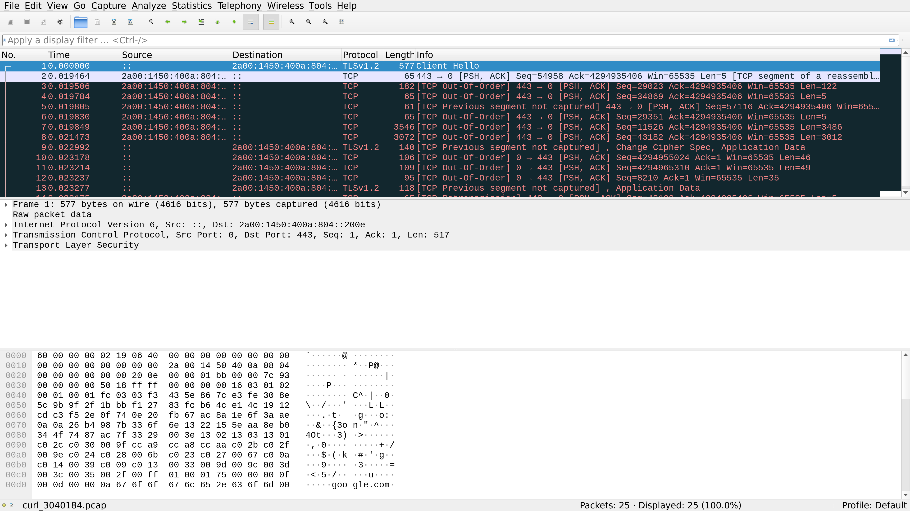

# NetSpy - Network Traffic Logger

NetSpy is a C++ Linux preloadable library that intercepts network-related function calls for a specific executable and logs all incoming and outgoing network traffic in PCAP format for later visualization with Wireshark.



## Features

- Intercepts all common network function calls: socket, bind, connect, accept, send, recv, sendto, recvfrom, etc.
- Uses JSON for function prototype specification and automatic C++ binding generation
- Logs network traffic in PCAP format compatible with Wireshark
- Supports both TCP and UDP over IPv4
- Thread-safe with minimal performance overhead
- Automatically names output files based on executable name and process ID
- Modern C++ design with proper class encapsulation

## Prerequisites

To compile and use NetSpy, you need:

- G++ or a compatible C++ compiler (with C++17 support)
- libpcap development headers and libraries
- Python 3 for code generation
- Standard Linux development tools

On Debian/Ubuntu-based systems, install dependencies with:

```
sudo apt-get install g++ libpcap-dev python3
```

## Compilation

Compile the library using the provided Makefile:

```
make
```

The build process includes the following steps:
1. Parse network_functions.json to generate C++ bindings
2. Generate header (generated_bindings_header.hpp) and implementation (generated_bindings_impl.hpp) files
3. Create netspy.cpp from netspy.cpp.in template
4. Compile the final library (libnetspy.so)

## Usage

To use NetSpy with an application, set the `LD_PRELOAD` environment variable to point to the library:

```
LD_PRELOAD=/path/to/libnetspy.so your_program [args]
```

For example, to monitor network traffic for curl:

```
LD_PRELOAD=./libnetspy.so curl google.com
```

The library will create a PCAP file named `[executable_name]_[pid].pcap` in the current directory. For example, `curl_12345.pcap`.

## Viewing the Captured Traffic

You can open the generated PCAP file with Wireshark:

```
wireshark [executable_name]_[pid].pcap
```

## Modifying Function List

To add or modify the intercepted network functions:

1. Edit the `network_functions.json` file
2. Rebuild the library with `make clean && make`

## Limitations

- Currently only supports IPv4 (not IPv6)
- Limited to TCP and UDP protocols
- The library assumes that file descriptors below 4096 are used for sockets

## Debugging

The library has debug output enabled by default. To disable debug output, change `constexpr bool DEBUG_ENABLED = true;` to `constexpr bool DEBUG_ENABLED = false;` in network_interceptor.hpp and recompile.

## How It Works

NetSpy uses:
1. The `LD_PRELOAD` mechanism to intercept library calls
2. JSON-based function prototype specification for maintainability
3. Python code generation to create C++ bindings
4. C++ classes for clean code organization
5. libpcap for PCAP file generation

This approach avoids the need for root privileges or special capabilities, as the library only sees the traffic generated by the specific application it's loaded with.
